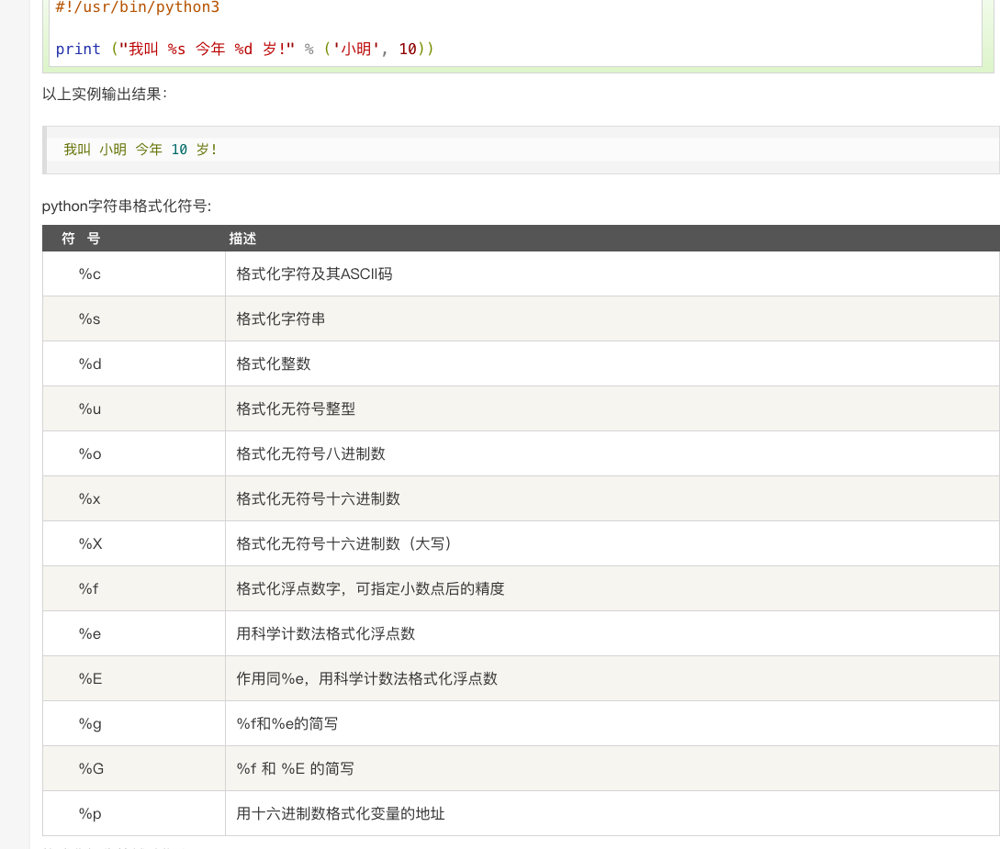
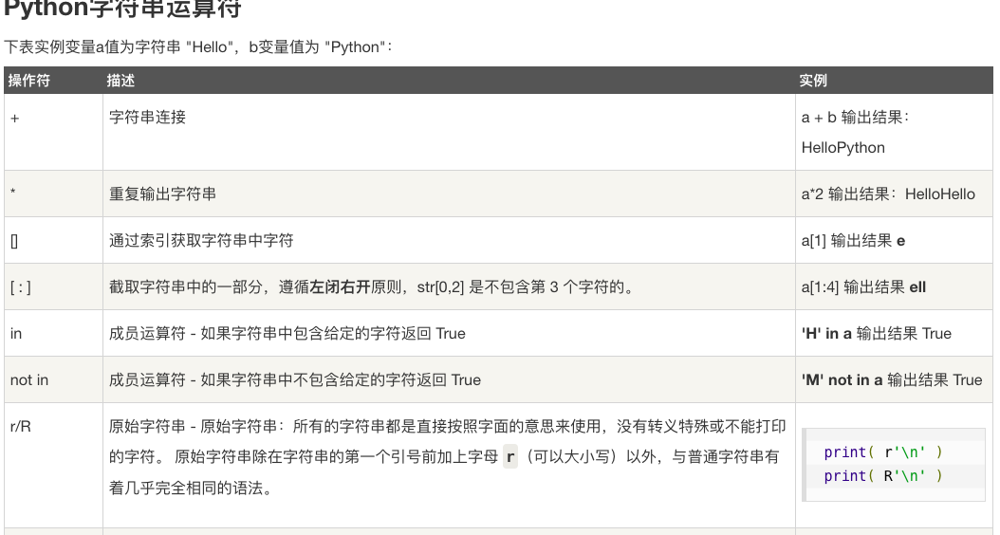
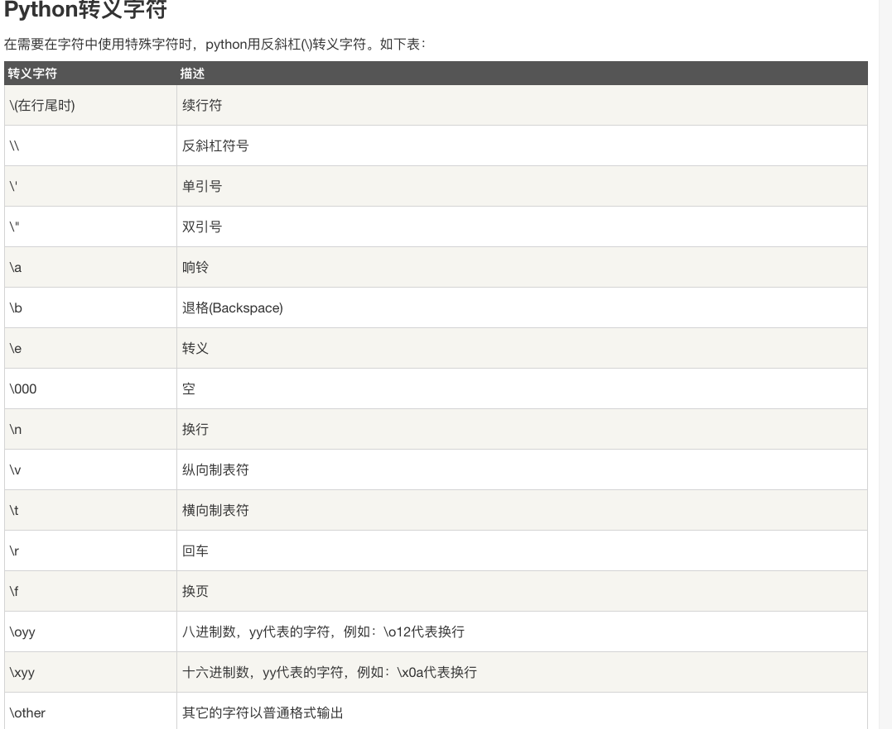
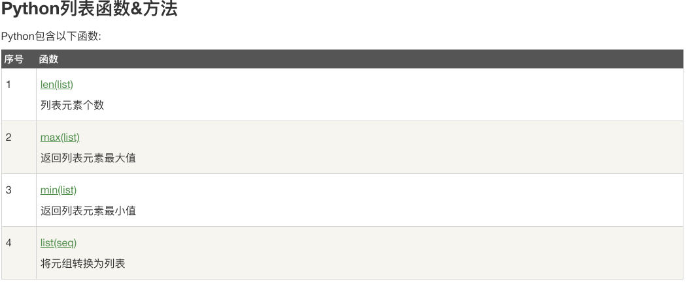
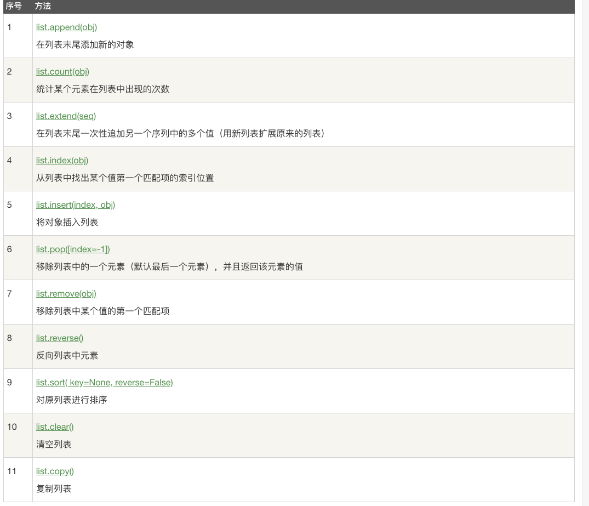
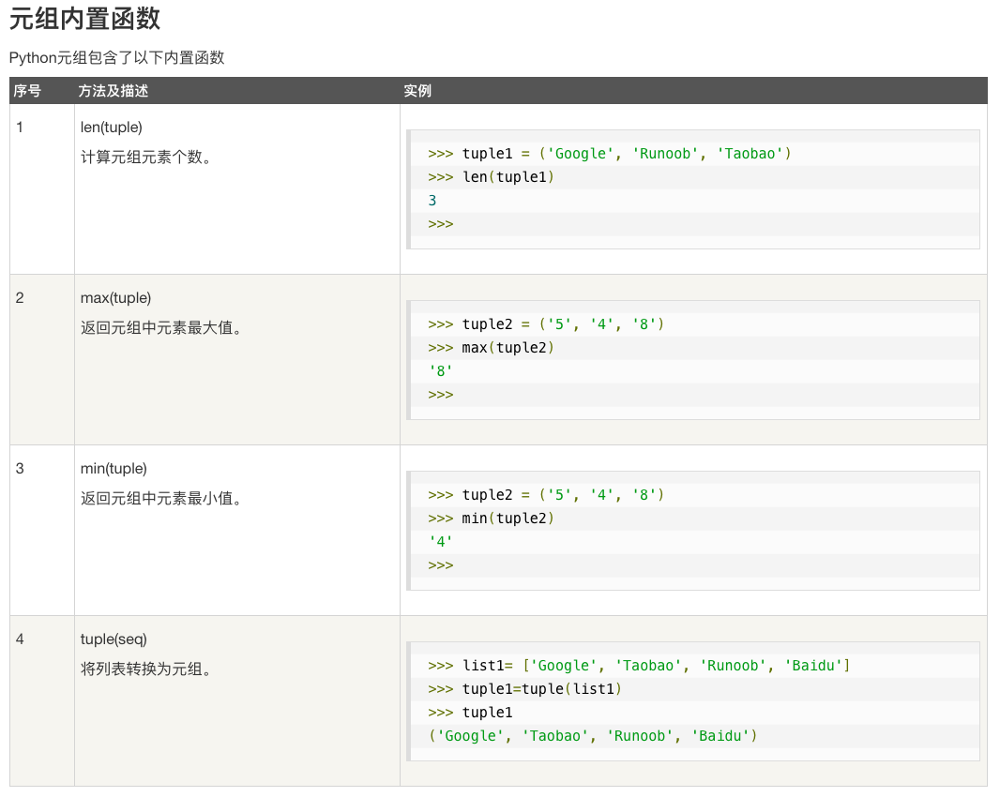
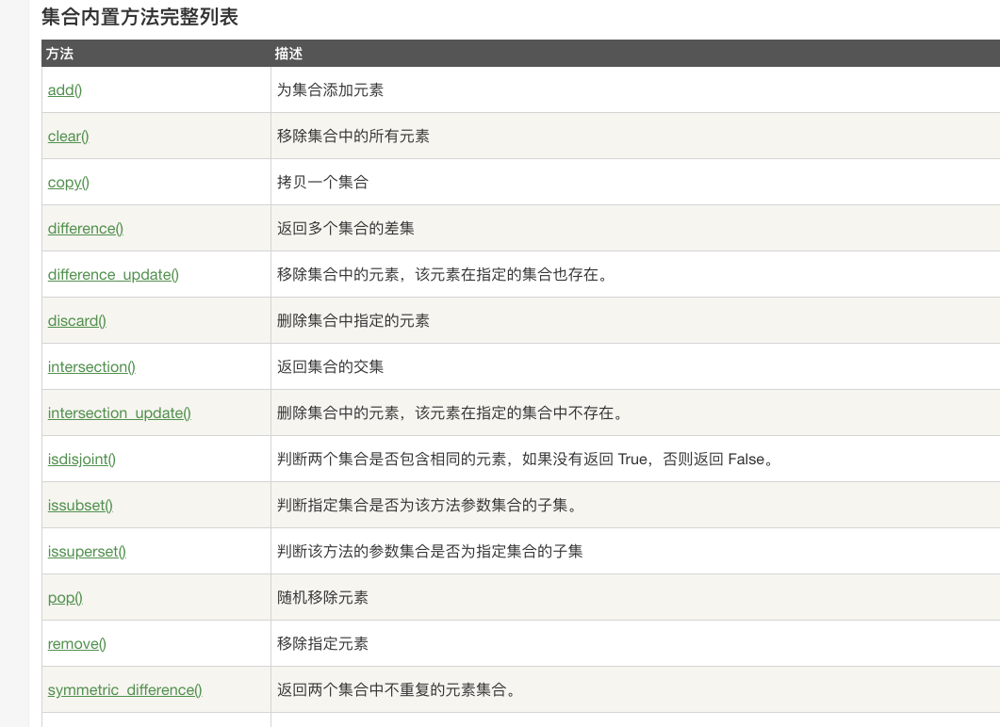
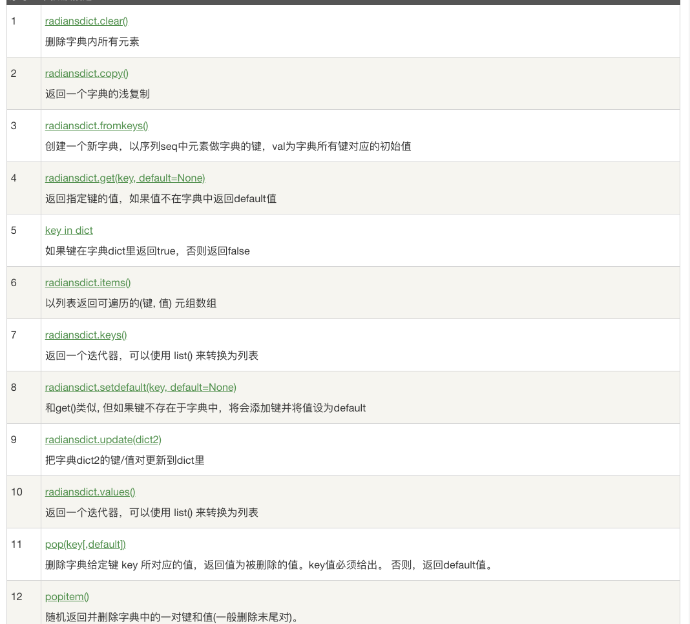

> 不可变数据类型： 当该数据类型的对应变量的值发生了改变，那么它对应的内存地址也会发生改变，对于这种数据类型，就称不可变数据类型。
>可变数据类型    ：当该数据类型的对应变量的值发生了改变，那么它对应的内存地址不发生改变，对于这种数据类型，就称可变数据类型。
>不可变数据
Number ---- 数字
String ---- 字符串
Tuple ----元祖
可变数据
List ----列表
Set ----集合
Dictionary----字典

> 判断数据的类型
1. type（）
2. isinstance（）
区别----后者会认为子类是一种父类类型
---
del 语句
删除一些引用对象
---
### number类型小结
1. Python可以同时为多个变量赋值，如a, b = 1, 2。
2. 一个变量可以通过赋值指向不同类型的对象。
3. 数值的除法包含两个运算符：/ 返回一个浮点数，// 返回一个整数。
4. 在混合计算时，Python会把整型转换成为浮点数。


### 字符串类型小结
1. 反斜杠可以用来转义，使用r可以让反斜杠不发生转义。
2. 字符串可以用+运算符连接在一起，用*运算符重复。
3. Python中的字符串有两种索引方式，从左往右以0开始，从右往左以-1开始。
4. Python中的字符串不能改变。




### list 小结
1. List写在方括号之间，元素用逗号隔开。
2. 和字符串一样，list可以被索引和切片。
3. List可以使用+操作符进行拼接。
4. List中的元素是可以改变的


### 元祖小结
1. 与字符串一样，元组的元素不能修改。
2. 元组也可以被索引和切片，方法一样。
3. 注意构造包含 0 或 1 个元素的元组的特殊语法规则。
4. 元组也可以使用+操作符进行拼接。
注意
tup1 = ()    \# 空元组
tup2 = (20,) \# 一个元素，需要在元素后添加逗号


### 集合小结
可以使用大括号 { } 或者 set() 函数创建集合，注意：创建一个空集合必须用 set() 而不是 { }，因为 { } 是用来创建一个空字典。

---
字典是一种映射类型，字典用 { } 标识，**它是一个无序的 键(key) : 值(value) 的集合**。
键(key)必须使用不可变类型。
**在同一个字典中，键(key)必须是唯一的**。
1. 不允许同一个键出现两次。创建时如果同一个键被赋值两次，后一个值会被记住
2. 键必须不可变，所以可以用数字，字符串或元组充当，而用列表就不行
``` PYTHON
del dict['Name'] # 删除键 'Name'
dict.clear()     # 清空字典
del dict         # 删除字典
```

----
> python 常用的数据类型转换

|函数|描述|
|---|---|
|int(x[,base])|将x转化为一个整数，默认是10进制|
|float(x)|将整数或者字符串转换成一个浮点数|
|complex（real[,imag]|创建一个负数（complex() 函数用于创建一个值为 real + imag * j 的复数或者转化一个字符串或数为复数。如果第一个参数为字符串，则不需要指定第二个参数。。）|
|str(x)|将对象x转化为字符串|
|repr(x)|将对象x转换为表达式字符串（s = 'RUNOOB'-->"'RUNOOB'"）|
|eval(x)|来执行一个字符串表达式，并返回表达式的值。|
|tuple(s)|将序列s转化为一个元组|
|list(s)|将序列s转化为一个列表|
|set(s)|转化可变集合（把一个集合变成一个个以字符串为单位的list）|
|dict(d)|创建字典|
|frozenset(s)|转换不可变集合|
|chr(x)|将一个整数转换为一个字符|
|ord(x)|将一个字符转化为他的整数值|
|hex(x)|将一个整数转换为16进制字符|
|oct(x)|将一个整数转换为8进制字符|

----
### 脚本式编程
python3 demo.py˚
> unix 系列还可以
```python
#! python3 path
```
给予执行权限并运行
```bash
chmod +x demo.py数字常量
./demo.py
```
--- 
python3 注视
单行可以用 ==#== 开头
单行用三个‘或者三个”
----
python 算数运算符
```
+ - * / //(向下曲接近出书的整数)
```
python算数运算符
```
== != > < >= <=
```
python 赋值运算
```
= += -= *= /= %= **=(幂复制运算c**=a == c=**a) //+（取整除赋值运算）
```
---

python 位元算符(把数据转换成二进制进行计算)

|运算符|描述|实例|
|---|---|---|
|&|按位与运算符：参与运算的两个值,如果两个相应位都为1,则该位的结果为1,否则为0|(a & b) 输出结果 12 ，二进制解释： 0000 1100|
|\||按位或运算符：只要对应的二个二进位有一个为1时，结果位就为1|(a \| b) 输出结果 61 ，二进制解释： 0011 1101|
|&|按位异或运算符：当两对应的二进位相异时，结果为1|(a ^ b) 输出结果 49 ，二进制解释： 0011 0001|
|~|按位取反运算符：对数据的每个二进制位取反,即把1变为0,把0变为1。~x 类似于 -x-1|(~a ) 输出结果 -61 ，二进制解释： 1100 0011， 在一个有符号二进制数的补码形式。|
|\<\<|左移动运算符：运算数的各二进位全部左移若干位，由"<<"右边的数指定移动的位数，高位丢弃，低位补0。|a << 2 输出结果 240 ，二进制解释： 1111 0000|
|\>\>|右移动运算符：把">>"左边的运算数的各二进位全部右移若干位，">>"右边的数指定移动的位数|a >> 2 输出结果 15 ，二进制解释： 0000 1111|
---
python 逻辑运算符
```
and or not
```
> 相当于C的 && \|\| !
---
python成员运算符
```
in not in
```
in即在指定序列查找该值，找到返回True， 否则返回False ，not in 反之
---
python 身份运算符
```
is not is
```
相当于C的== ！!=
当然python 也可以用id()函数来实现类似于C语言的表单形式（id(x) == id(y)）
--- 
python 运算符优先级
```python
** <-  ~ +-(一元) <-    */% // <-      +- <-    >> << <-  &   <-^| <-     <= < > >=(比较)  <-   = %= /= //= -= *= **=     <-  is is not <-    in not in  <-   and or not
```